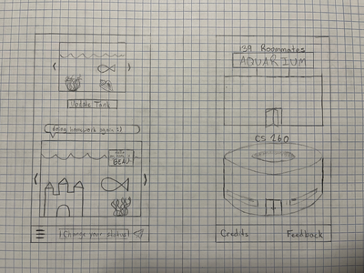

# Startup
CS 260 Startup Application

## Elevator Pitch

### Fish tanks in an aqurium -- still working on the name
The application is a simple social media that allows users to create and join private spaces called aquariums. In each aquarium, users maintain a unique fish tank. Users can customize the shape of their tank, the fish, and the decorations in the tank. Users can communicate in the application by sharing a simple status such as `:)`, `at work`, or `zzz` though their fish. Users will also see if another user in the same aquarium is active at the same time.

## Sketches



## Important things to remember
##### My IP Address:  
```
3.141.183.154
```
##### SSH into my server:
```
ssh -i [key pair file] ubuntu@3.141.183.154
```
##### My Domain Name:
```
byancey.click
```
##### Deploy Changes
```
./deployWebsite -k [key pair file] -h byancey.click -s [simon/startup]
```

## HTML Notes
+ HyperText Markup Language  
+ Some tags don't need an opener and a closer, one tag such as `<br/>` is sufficient
+ Always start with `<!DOCTYPE html>` and `<html lang="en"> ... </html>`

## CSS Notes
+ Elements are styled with `elementname {}`
+ Classes are styled with `.classname {}`
+ Ids are styled with `#idname {}`
+ Pseudo-classes are styled with `selector:pseudo-class {}` such as `a:hover {}` or `.checkbox:checked {}`
+ Animations are created using the following syntax:
```
selector {
  animation: name duration infinite?;
}

@keyframes name {
  from {
    initial conditions;
  }
  50% {
    conditions in the middle;
    does not need to be 50%;
    can have more than one of these;
  }
  to {
    final conditions;
  }
}
```
